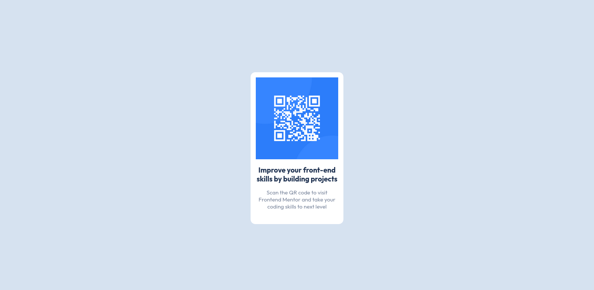

# Frontend Mentor - QR code component solution

This is a solution to the [QR code component challenge on Frontend Mentor](https://www.frontendmentor.io/challenges/qr-code-component-iux_sIO_H). Frontend Mentor challenges help you improve your coding skills by building realistic projects.

## Table of contents

- [My process](#my-process)
  - [sass](#built-with)
  - [resizing elements](#what-i-learned)
  - [google fonts](#useful-resources)

## Overview

### Screenshot



### Links

- Solution URL: [Add solution URL here](https://github.com/limsael/limsael.github.io.git)

## My process

### Built with

- Semantic HTML5 markup
- Sass nesting properties
- Flexbox

### What I learned

```css
body {
  display: flex;
  justify-content: center;
  align-items: center;
  height: 100svh;
}
```

### Continued development

Sizing the container, update the font size of some elements.

### Useful resources

- [Google Fonts](https://https://fonts.google.com/) - This helped me for choosing the font.
- [Modzilla Developper Network](https://developer.mozilla.org/en-US/) - This is an amazing article which helped me finally understand flexbox. I'd recommend it to anyone still learning this concept.

## Author

- Github - [@limsael](https://github.com/limsael)
- Frontend Mentor - [@limsael](https://www.frontendmentor.io/profile/limsael)
